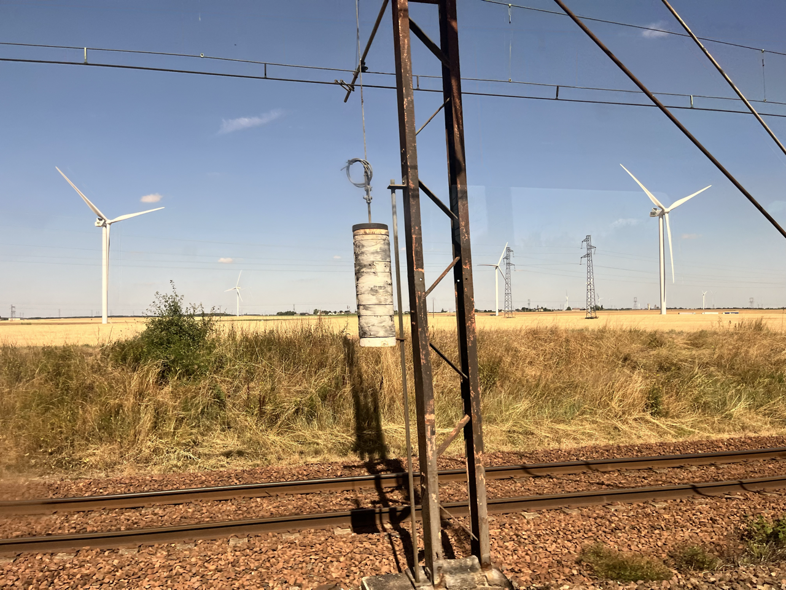
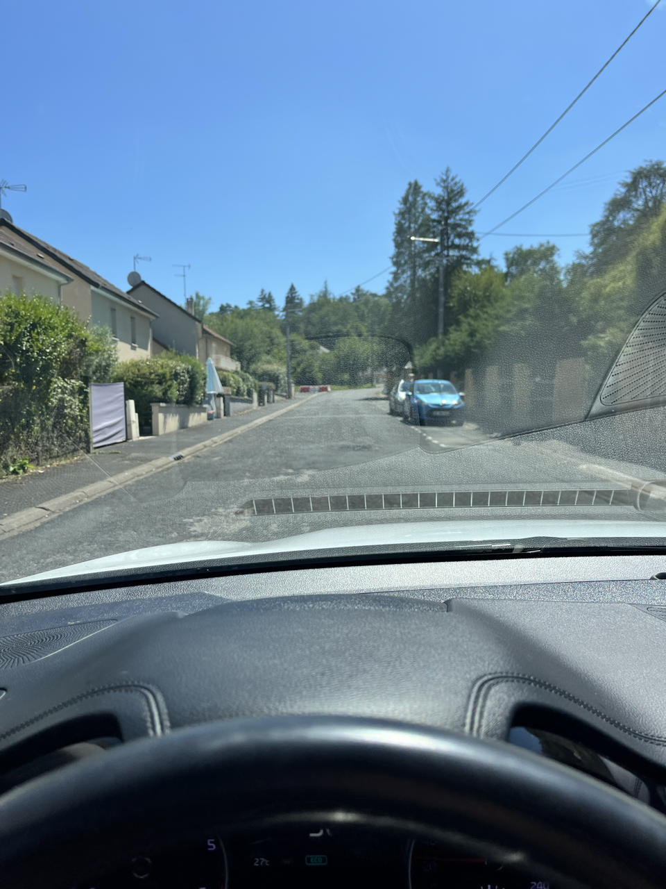
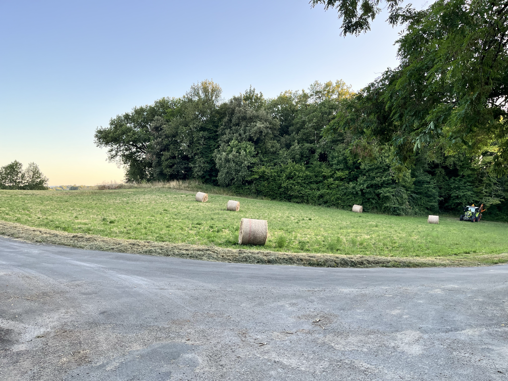
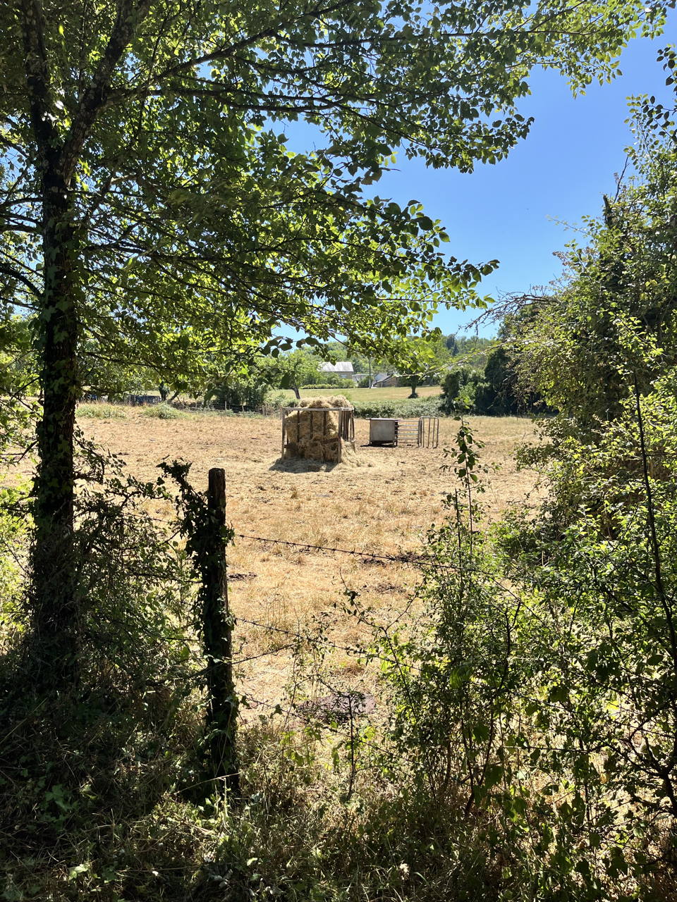
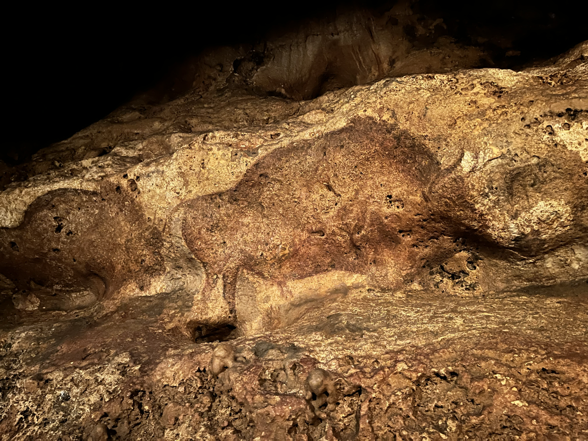
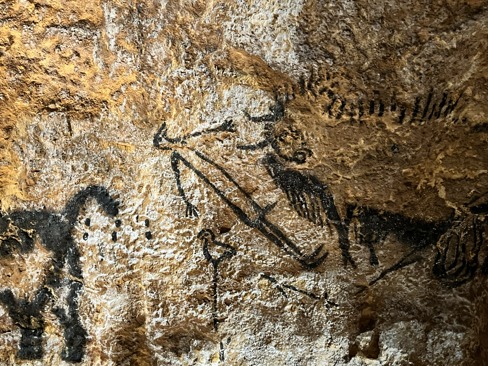
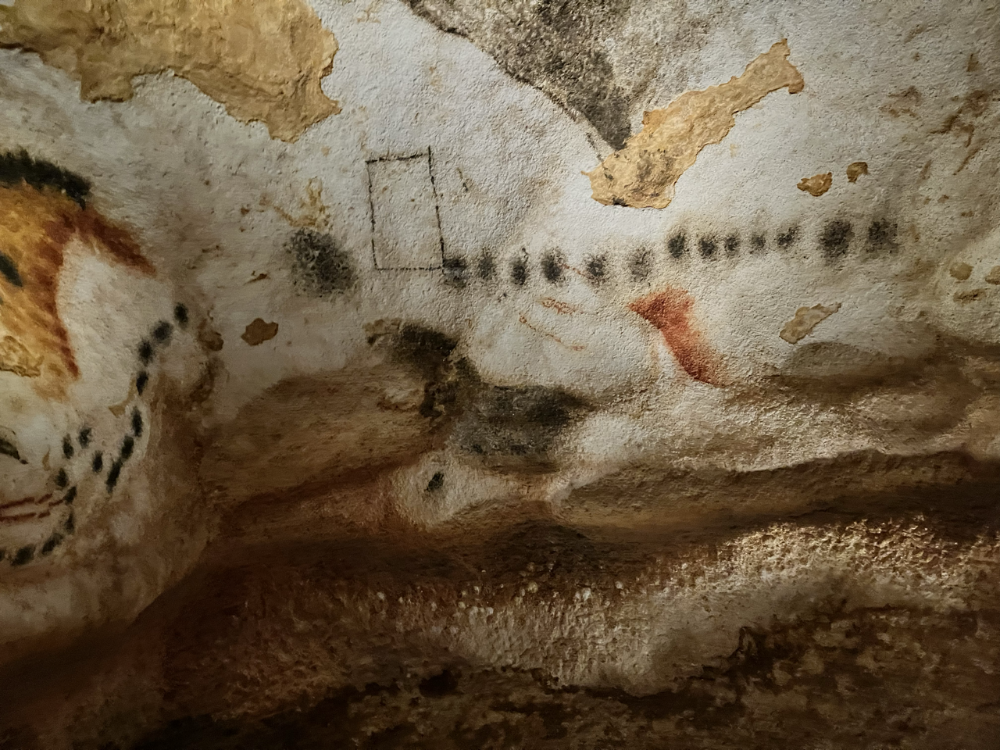

+++
draft = false
title = "Valley of Man"
[params]
    post_image = "train.png"
+++

It’s time to get out of the city and go climb something. I wanted a full slice of the French life and there’s no better way to do that than hop off at a random train station and put around in a car for a bit. 

They actually give anyone a car it turns out

A quilt of rolling farmlands knitted together by boujee towns, the Dordogne region was surprisingly a taste of home. If you look past the architecture and small cars, it was more like western mass than not. 

It felt good going on long hikes through the hills and kayaking along the rivers.

However what makes it markedly different than the Berkshires is its Vézère Valley. Somewhere between 17k-22k years ago, multiple generations of migratory humans, seeking shelter from the tundra winds, made a home of the cave systems up in the hills here. They hunted herds of bison, reindeer, horses, aurochs, and ibexes. They slew wooly mammoths and feared Sabre tooth cats. And they made art. 

In the dim light of animal fat candles, they mixed together pigments from nearby mineral deposits with clay and fat, they napped stones to make chisels, and they built scaffolding to reach the higher reaches of the cave. And they experimented with drawing techniques, too. Sometimes applying by hand, other times smearing paint onto animal hide and rubbing it on the wall, and they even hollowed out animal bones and used them as a blow dart of paint (which is how they made the famous hand outlines). Almost all of the drawings were of animals they saw, sometimes humans, and sometimes mythological beings. It wasn’t just 2D simple outlines too. Much of their work played with the natural features of the cave wall. Here these top half images of stags on top of a jutting outline depicts a river crossing, there in the concave nook the bison pointing in opposite directions makes it look as if they are running past you. My favorite scene was a stag licking the forehead of a doe - still a mating behavior of deer today, but maybe the artist thought of it as a reindeer kiss.

They never drew landscapes or flora, and the only human depiction I saw was of a bird-man like thing. 

The most enigmatic detail of these caves is the use of geometric shapes. Their meaning lost to time, some theorize it was way of communicating with the next group of inhabitants to use the cave as a campsite. Or, because the same symbols appear across multiple caves, possibly it was tribes marking territory. 

I only saw two caves during my time here, the second was Grotte Font de Gaume - one of the last remaining prehistoric sites still open to the public. The profoundness of what I saw didn’t hit me until a day later while reflecting on the train. Maybe it was because I was accustomed to curated exhibits wherein everything from the building itself to the frame on the piece were carefully selected for my viewing pleasure. It takes a seismic shift in perspective to look past the tour guide and the hand rails and really come to terms with this cave is the same exact cave we lived in before, the  small outline of hand is really, truly from one of us from so long ago saying “I’m here”