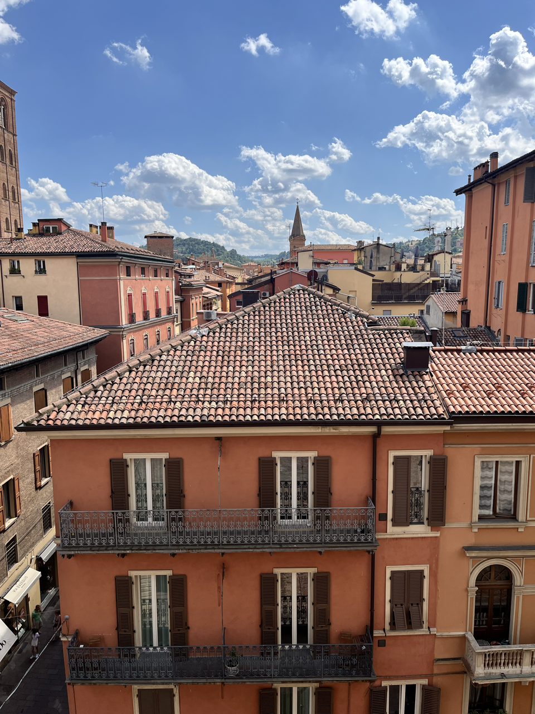
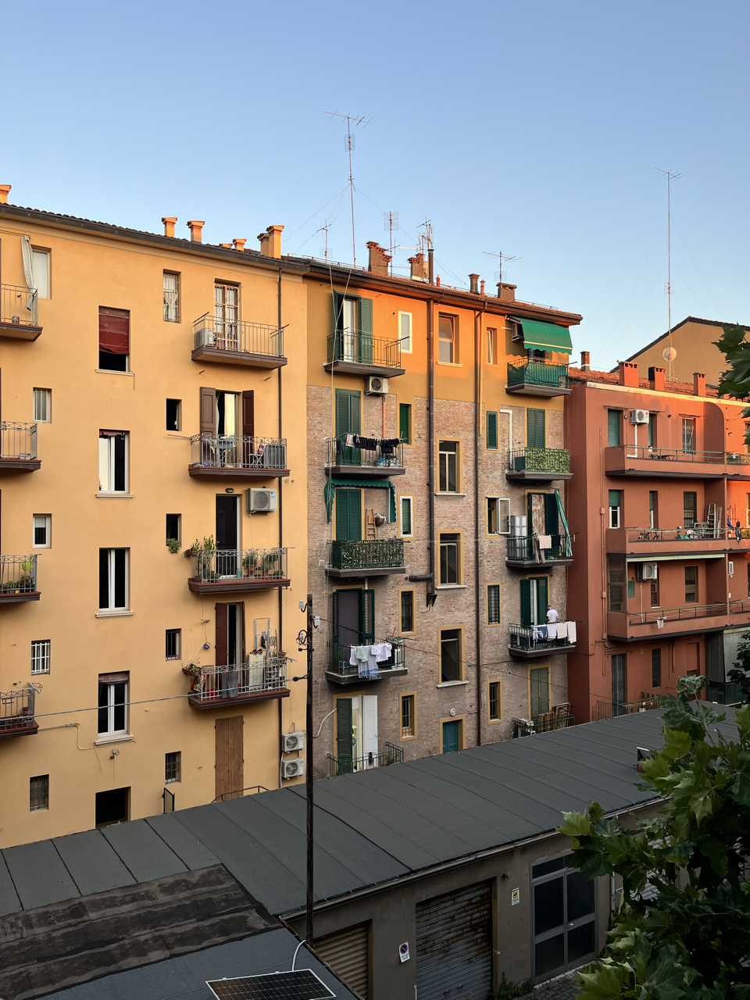
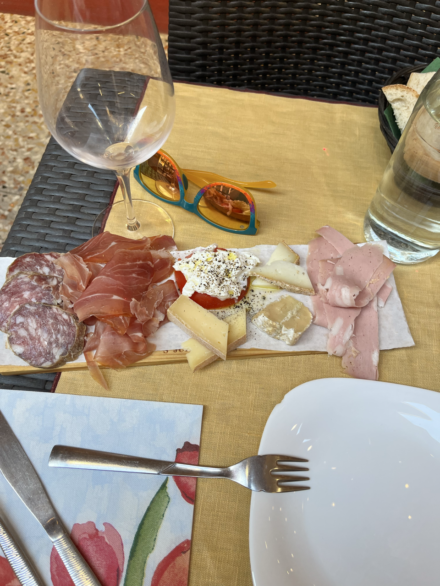
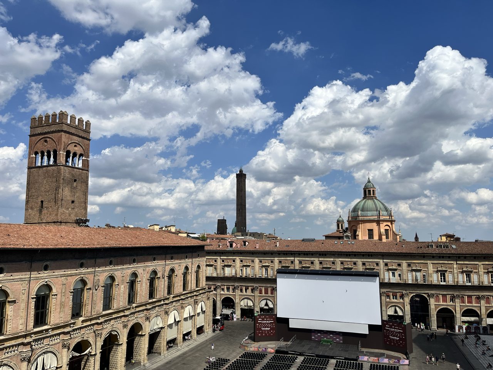
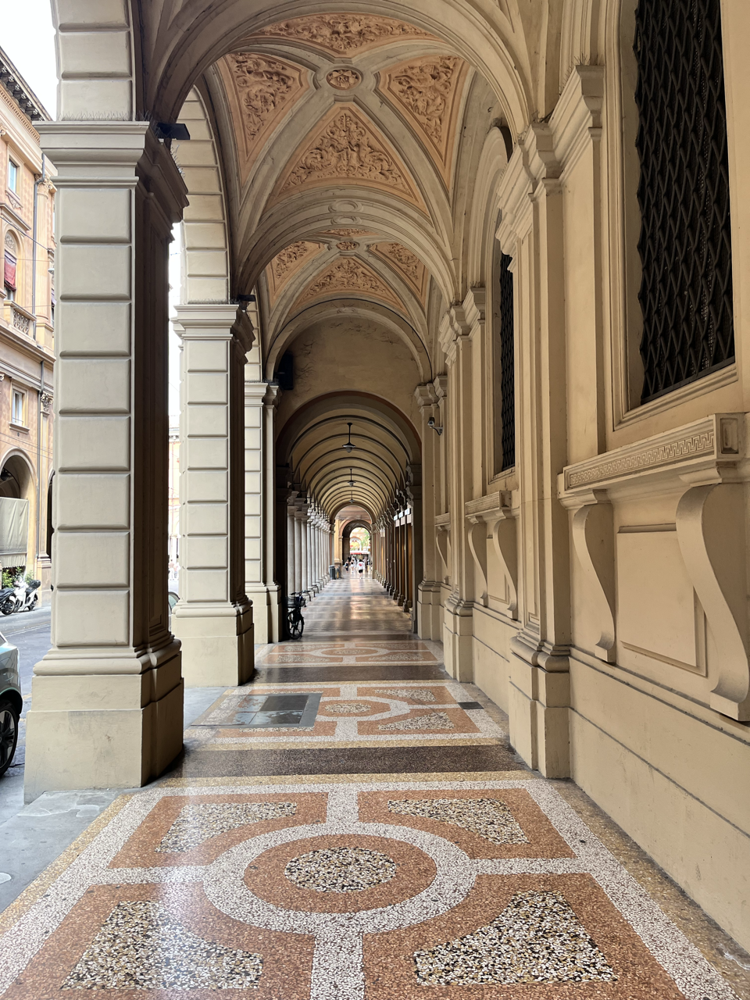
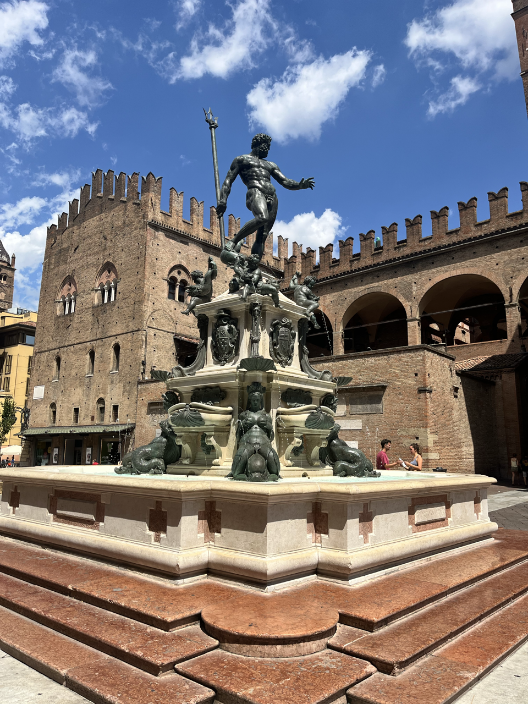
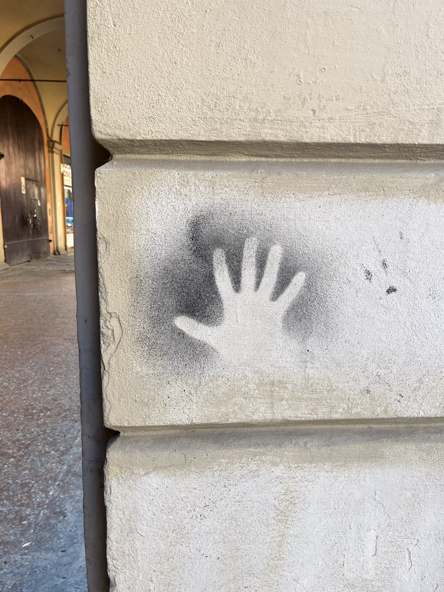
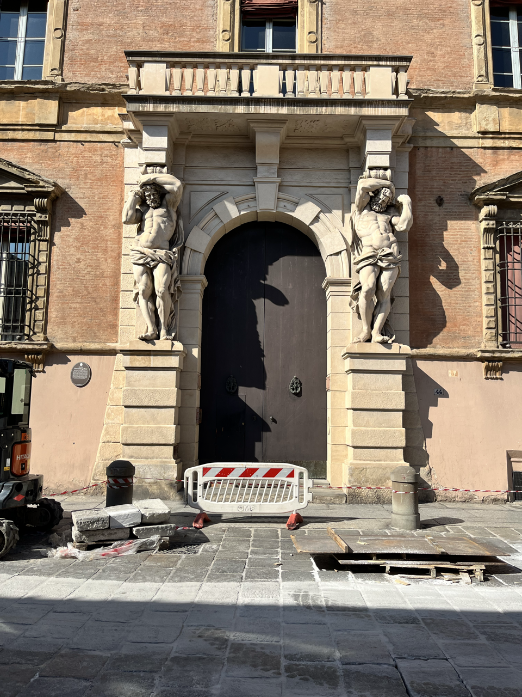

+++
draft = false
title = "Bologna"
[params]
    post_image = "images/cityView.png"
+++

I think if I came to Bologna at any other point in my trip I would have been disappointed. There is honestly not much to do here but walk around and eat food. It gave me a nice lull before heading off to Rome. 

I stayed in the apartment of a nice Italian man, did some laundry, watched a movie one night without feeling guilty. 

I ate lots of cold cuts, cheese, and pasta. Went on a food tour to eat more cold cuts, cheese, and pasta. And walked around the Roman/Middle Ages city center.

If you must know, Bologna’s defining features are its towers and porticos. 

The towers, once numbering in the hundreds, were a mixture of observational/defensive tools and also private ones built by families to flaunt their wealth. 

The porticos mark a time during the Middle Ages when the urban population was growing rapidly. City architects wanted to expand the capacity of the homes, while not intruding on the walkways for pedestrians and carts. The solution was an extension of the upper floors supported by arched supports from below. The city actually has the longest portico in the world (2.4 miles) leading from the city to the Sanctuary of the Madonna di San Luca.

They’ve also got this fountain of Neptune (which seems like odd choice to me for a landlocked city but what do I know), which the trident tip is used as the logo for Maserati. 

Oh and they also have the oldest university in the world which brings to the city a cool undercurrent of trendy kids. 

Some things never change.

What I did appreciate is that they don’t seem to let the “sacredness” of the past hinder them from improving the city. They are currently undergoing a major installation of tram lines on from the center to make the city more maneuverable. 