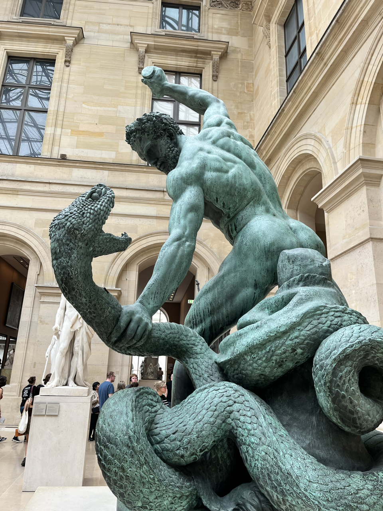
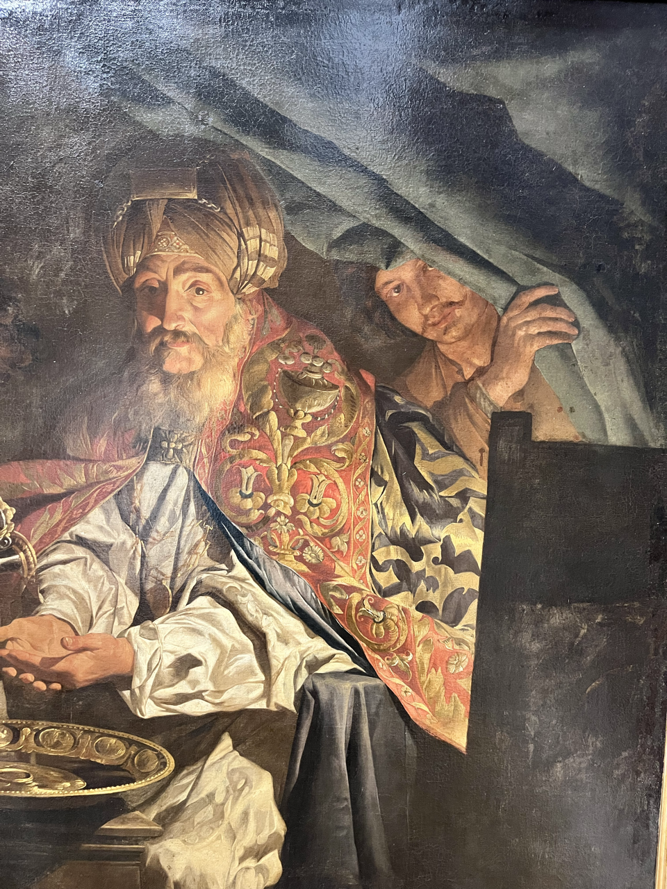
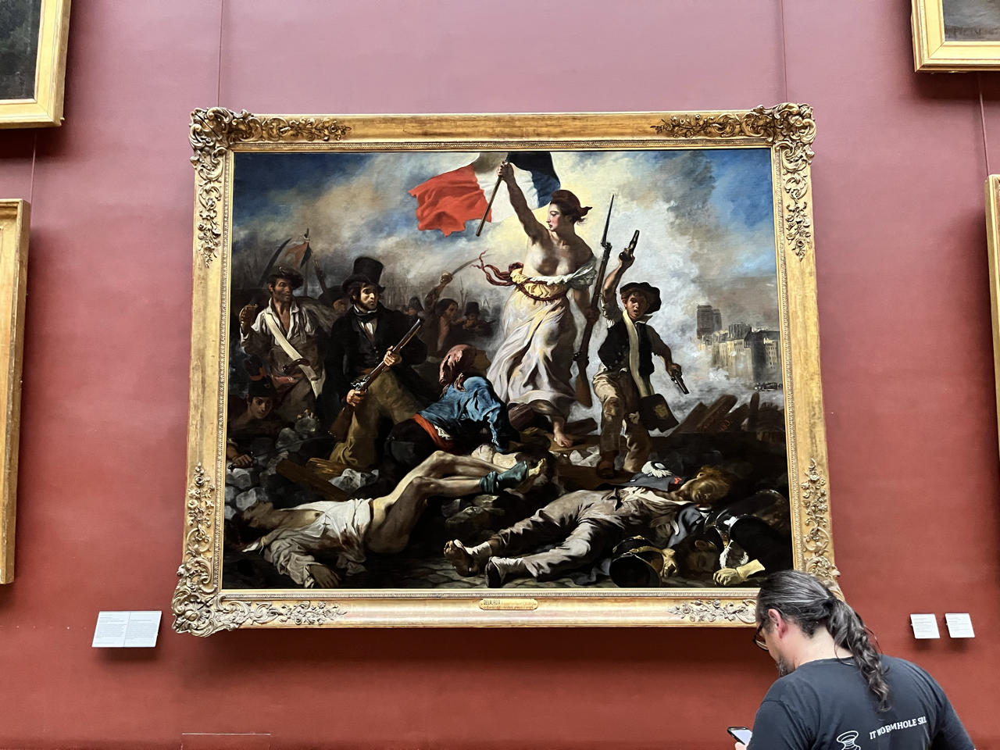

+++
draft = true
title = 'Le Louvre'
[params]
    post_image = 'images/serpentStrike.png'
+++

Today *was* the Louvre. A heroic 10am - 4:30pm making it a personal best for time at a museum. See the strat to museum endurance is start with the "learning" stuff. Egyptians, Punics, Phoenicians, Syrians, Persians. The stuff that requires a map, a list of rulers, and wikipedia.

Syrian artwork during Roman occupation was strikingly beautiful

The Egyptians have alwags been in a league of their own for me. At the same time Europeans were a diffuse hodgepodge of simple farming societies - without even the slightest concept of writing - Egyptians were out there building the pyramids, had vast developed cities, and lived in a complex structure of the crown and polytheistic (except for that one time when a pharoah made it monotheistic, but they got rid of that right after he kicked the bucket) temple.

And more importantly, their artwork feels modern. It's off-putting, bold, and controlled. It blends the bizarre with reality in playful colors defined in by strict lines. You just know that if an artist revealed a 3m tall statue of a lioness/woman hybrid today, Doja Cat would make it her next album cover. But no one does because the egyptians did it already 6,000 years ago.

I guess the death stuff stands out as well

Anyways the next stage of the museum tour is purely vibe based. Look for the stuff that evokes something in you. Find something you fuck with and stop reading the plaques about the portrait of another merchant in the 16th century. If it's boring, move on. 

An endearing quirk of reinassance painters is they always have some guy looking at you like "can you believe this shit?"

And you know what, I'm just going to say it now. I'm an LLM hater like any true patriot, but chatgpt makes for a fantastic museum companion. You can ask it all the hyper specific questions you have like "why is this dog so detailed for the time period? Did this cardinal own a dwarf? Tell me about this bean king." Game has to respect game, and chatgpt's game is telling me how excellent and unique my questions are.

It's not even their best album

In the evening, I chatted with two friends who frequent my hostel to play chess and piano. One an immigrant from Brazil and the other a Parisian native who lives a little north of the city. The parisian is a musician who makes his own techno music. He pulled up Spotify and showed me a band. It was fine music, maybe not something I would listen to but pretty good. He tells me that the entire band (the name, the photo, the bio, and music) was generated by Spotify with A.I. He tells me he's scared that there won't be a world for him anymore when these massive corporations can replicate and replace his music within seconds. It left me with a bad taste in my mouth. Is using chatgpt as a museum guide as innocent as it seems? Are we just going to become to consumers making nothing of our own anymore? Will the paintings of the future be generated by a prompt? And if those paintings can still evoke a feeling in you, still play with symbolism and chiaroscuro, maybe even better than what we could've done ourselves - will they hang in the louvre as well?
