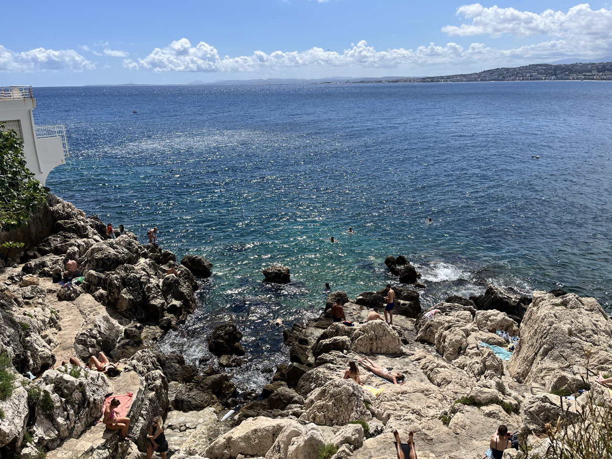
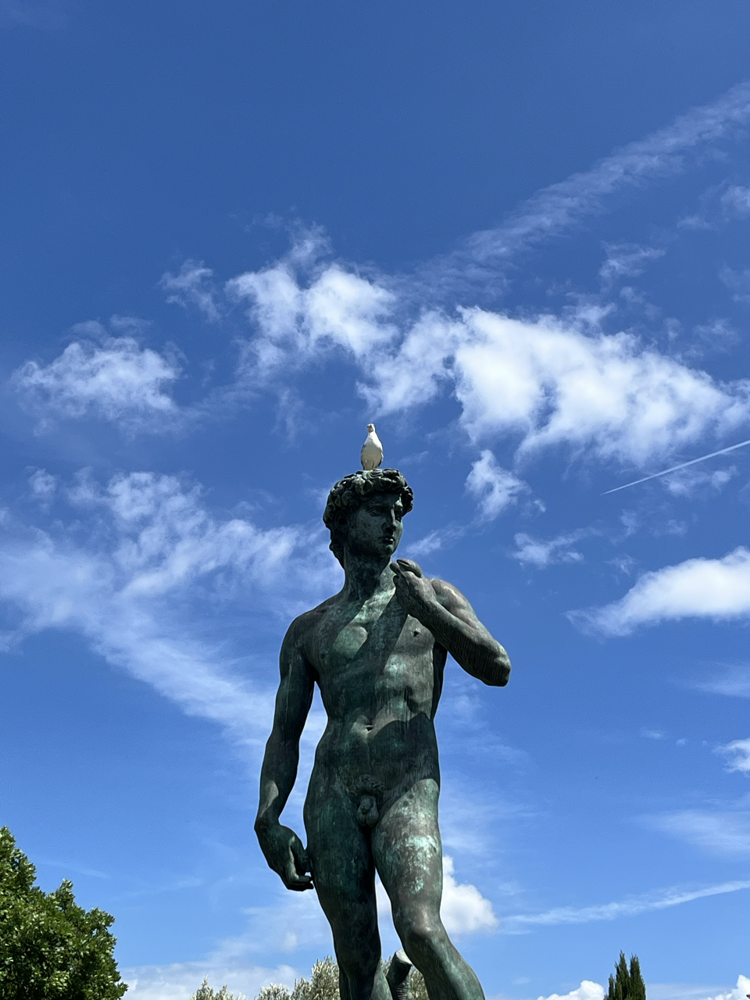
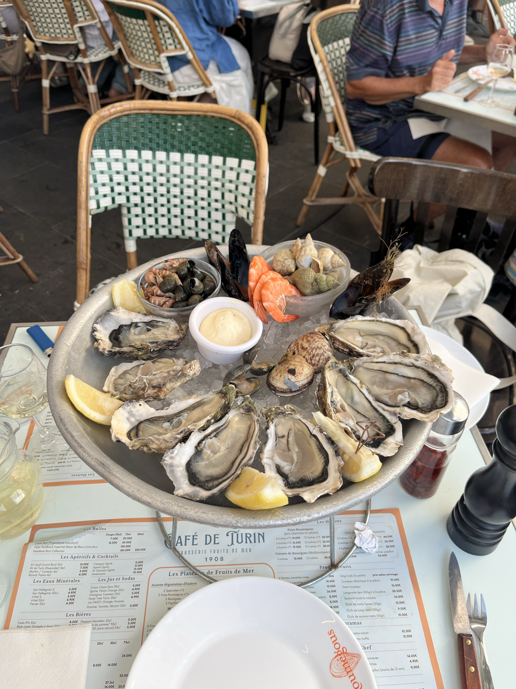
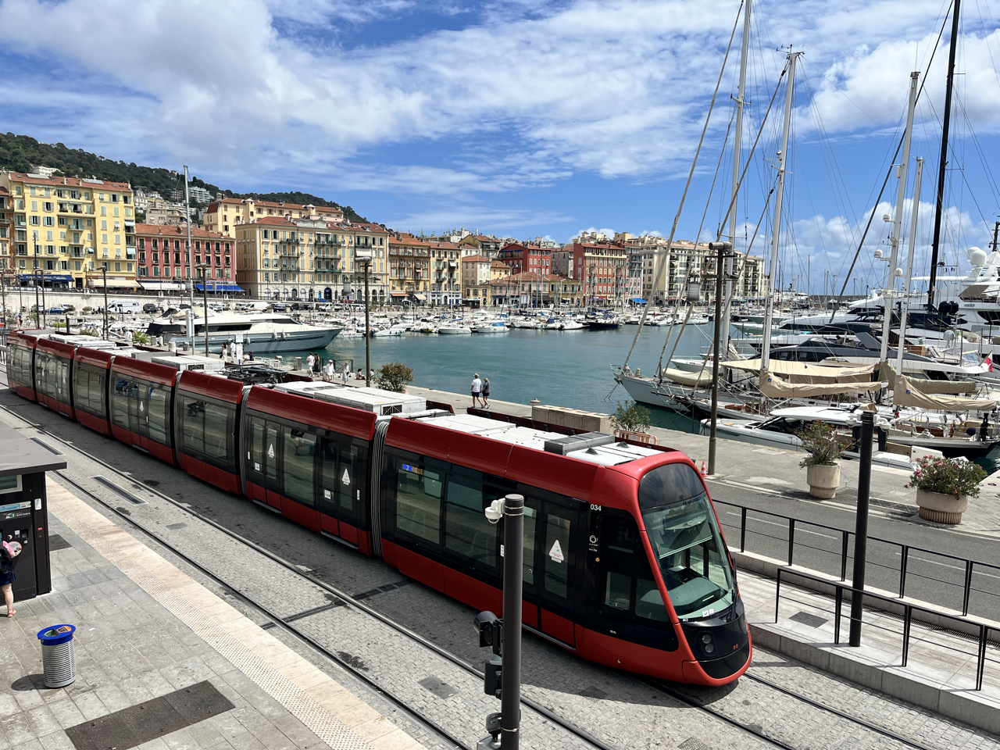
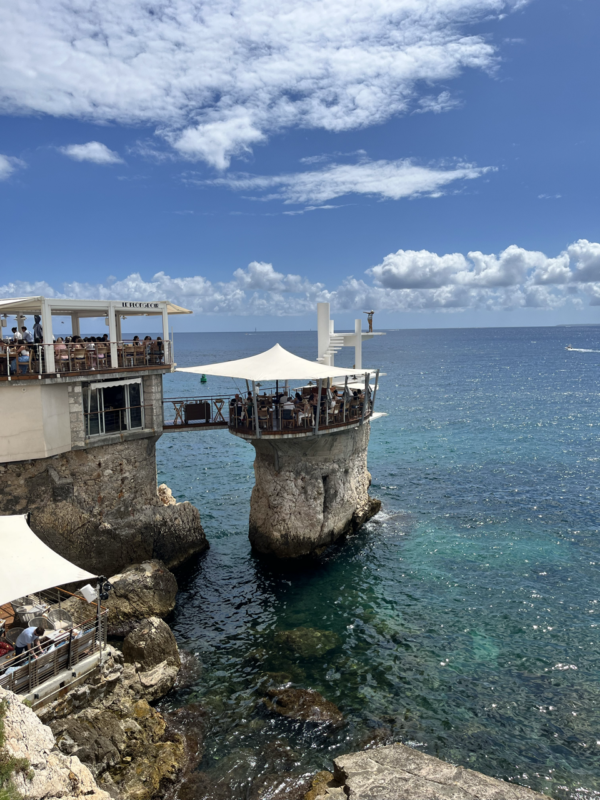

+++
draft = false
title = 'Beach Time'
[params]
    post_image = 'images/rockHoppers.png'
+++

It’s beach time, baby. Throw on the sunglasses, slap on that shirt that reads “beach vibes” with a skeleton holding a surfboard, get on the swim suit, and slap around in some flip flops (I actually forgot to pack my flip flops, if you’ll excuse my literary liberties). It’s Nice and there is no better place to unashamedly be a Tourist. It’s no time for those slow, achey walks through galleries. 

Everyone's a critic.

Take a dip in the Mediterranean, dry off with a book, and walk up to a beach- side cafe for an aggressively blue drink under an umbrella.

In the evening, have a lobster bisque and seafood platter. Or, more reasonably, enjoy the fine delicacies of store bought tortellini and ravioli with your hostel mates in a one-burner kitchen (have some yogurt with your pasta and tomato sauce - it’s strange but surprisingly good).

There is something barbaric about eating shellfish.

In europe, even their habors have trains. 

I did end up exploring the neighboring cities along the Riviera. They are all mostly the same thing, respectfully. This one has a village on a hill and that one has beaches with sand instead of rocks, but really you spend the day meandering about and getting hot enough to hop in the water.

Actually my time in Nice marked my second country of the trip: Monaco. Gotta say, you can skip it. It's just expensive yachts in an expensive harbor. I was really looking forward to the aquarium there. The world’s richest country per capita must have a killer aquarium, right? Wrong. I actually like the Boston aquarium better, and that’s a small one as aquariums go. And there is nothing else to do there. Their culture is money and money is soulless.

The coolest restaurant I've seen. 

At night, you sit on the rocky shores sipping drinks that stores technically shouldn’t be selling (but here we are), chatting with temporary friends about nothing, watching the tide bound toward you, and throwing rocks into the dark. 