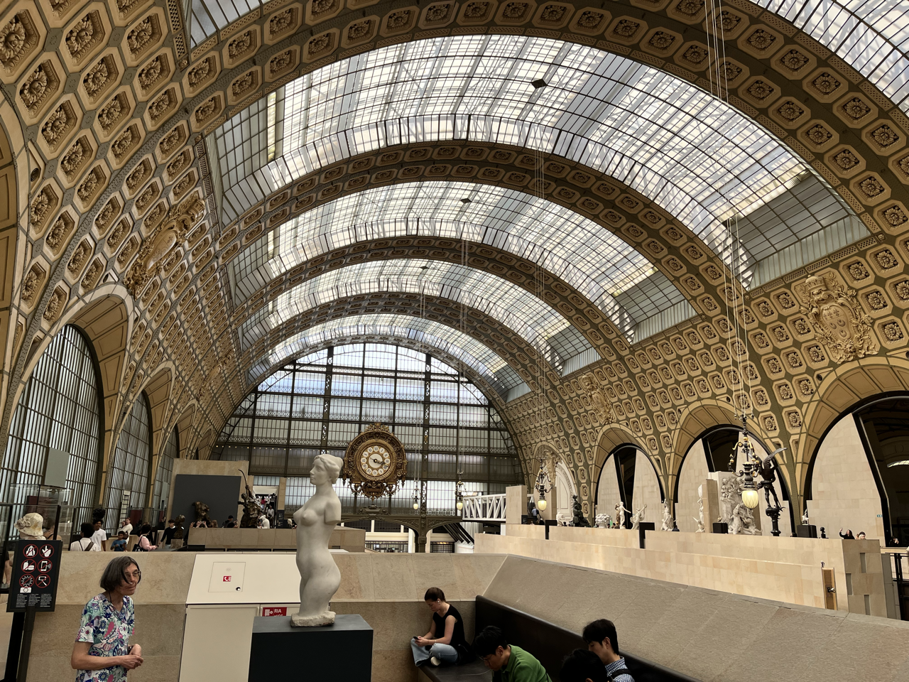

+++
draft = false
title = "Paris, Fin"
[params]
    post_image = "images/cat.png"
+++

I didn't scratch my artistic itch at the Louvre so I headed to Musée de Orsay, enjoying another stroll in the city. I couldn't help but notice how beautiful the city is, and hadn't even seen the Eiffel tower or Arc de triomphe. It's immaculate and noticeably quiet.

You can now officially swim in the Seine after the herculean effort to clean it up for the Olympics

Even the street art is beautiful. Street art is actually amazing here, on par with NYC, you could spend a day just walking around and looking at it all.

Speaking of beauty, Orsay is a refurbished train station turned museum - encompassing the exhibits in elaborate glasswork and filtered light.

So sad, these poor people don't know you can get a photo of Starry Night online for free :(

After the museum, starving and wanting a final send off, I saught after the most quintessential French meal I could find. And so it goes: pear cider, french onion soup, roasted duck breast and pear, and summiting the peak with a crème brûlée.

At night, my hostel friends invited me to an jam sesh in what appeared to he old wine cellar (lots repurposed stony undergrounds around these parts). Bands jumped on and off stage, groups formed sporadically based on who knows what song or which instrument, at one point of our friends hopped on stage and sang a song! It was loud and it was awesome. 